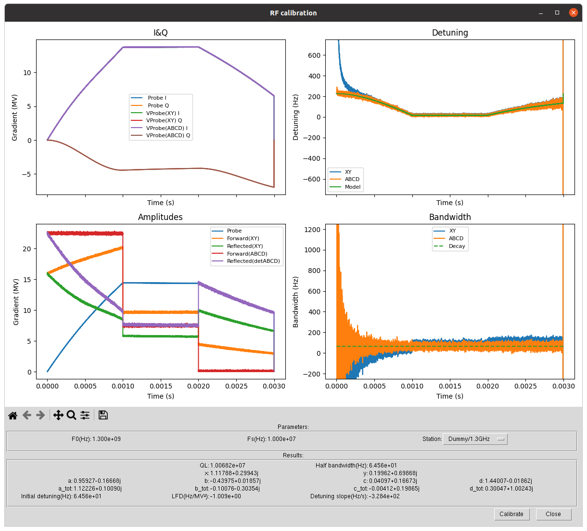

Introduction
============

This program facilitates the forward and reflected RF channels calibration of superconducting accelerating systems. See [the related publication][1].

The program works with different particle accelerator control systems ([Doocs][2], [Epics][3], [OPC-UA][4]) interfacing with the [DESY's LLRF server][5]. However, it is also possible to add new control or LLRF systems.

This program refers to an unique combination of an SRF cavity and a LLRF system to be calibrated as a *station*.



Installation
============

```bash
  python3 -m pip install git+https://gitlab.desy.de/msk-llrf/scripts/python/common/calibration-abcd-decay-based
```

Make sure to install the package on the interpreter where either pydoocs or deviceaccess library are present

Usage
=====

The package define a program that can be called from the shell. Below the program options
```
Usage:
    srf_abcd_calibration [--group=<gp>] [--stations=<sts>] [--conf=<cf>] [--nox=<st>] [--verbose] [--list-available] [--list-types] [--bootstrap-conf] [--dry-run] [--info-station=<st>]
    srf_abcd_calibration (-h | --help)

Options:
    -h --help           Show this screen
    --conf=<cf>         Use an alternate .toml configuration
    --nox=<st>          Run the calibration script on a station in text mode
    --verbose           Print the calibration results (text mode only)
    --list-available    Print all available station names and return
    --list-types        Print all types of stations that can be created and return
    --bootstrap-conf    Generates a file named config_user.toml with example configuration and return
```

When no options are passed, the program is executed in graphical mode loading all the systems defined in the default [.toml][6] configuration.

Alternatively the script can be run with.
```bash
  python3 -m srf_abcd_calibration.main
```

Program usage example
---------------------


### Use an user defined configuration file

```bash
  srf_abcd_calibration --conf=myconf.toml
```

### List available stations

```bash
  srf_abcd_calibration --list-available
```

### List available system types

```bash
  srf_abcd_calibration --list-types
```

This switch is useful to see if a particular type of LLRF system can be used. This usually (and should) depends on the available packages installed on the system.

- `DesyDoocsSCAV` and `DesyDoocsMCAV` are available when the package `pydoocs` is installed
- `DesyChimeraTKSCAV` is available when the package [`deviceaccess`][7] is installed.

### Run the program in non-graphical mode and print the results

```bash
  srf_abcd_calibration --nox=Dummy/1.3GHz --verbose
```

Customize stations
==================

The program use the [TOML][6] configuration file format. A station is defined by defining a new table in the configuration file. The fragment

```toml

# ...

[MyLLRFStation]
type="Dummy"

# ...

```

defines a new station named `MyLLRFStation` with type `Dummy.

The common station properties are listed below

| Configuration parameter | Meaning                                         | Default      |
| ----------------------- | ----------------------------------------------- | ------------ |
| name                    | Optional name that overrides the table name     | None         |
| type                    | LLRF system type. See below                     | None         |
| start_time              | Optional start time of the RF pulse (s)         | 0            |
| stop_time               | Optional stop time of the RF pulse (s)          | None         |
| max_adc_scaling         | Optional maximum trace scaling to apply to HW   | 2.0          |
| min_adc_scaling         | Optional minumum trace scaling to apply to HW   | 0.1          |
| max_abcd_scaling        | Optional maximum magnitude of abcd coefficients | 2.0          |
| plot_det_scale          | Optional plotting range for detuning (Hz)       | [-750, 750]  |
| plot_hbw_scale          | Optional plotting range for bandwidth (Hz)      | [-250, 1250] |

Station types
-------------

### DesyDoocsSCAV

| Configuration parameter      | Meaning                                        | Default |
| ---------------------------- | ---------------------------------------------- | ------- |
| address                      | SCAV LLRF control system (CTRL.) DOOCS address | None    |
| gradient_meter_address       | Optional address of a gradient metering device | None    |
| gradient_meter_normalization | Cavity gradient normalization                  | 1.0     |


### DesyDoocsMCAV


| Configuration parameter      | Meaning                                        | Default |
| ---------------------------- | ---------------------------------------------- | ------- |
| address                      | MCAV LLRF cavity (.Cx) DOOCS address           | None    |
| gradient_meter_address       | Optional address of a gradient metering device | None    |
| gradient_meter_normalization | Cavity gradient normalization                  | 1.0     |


### ChimeraTK

| Configuration parameter      | Meaning                                        | Default |
| ---------------------------- | ---------------------------------------------- | ------- |
| dmap_path                    | LLRF control system DMAP file path             | None    |
| device_name                  | ChimeraTK device name                          | None    |
| gradient_meter_address       | Optional address of a gradient metering device | None    |
| gradient_meter_normalization | Cavity gradient normalization                  | 1.0     |
| probe_amp_address            | Probe amplitude address                        | None    |
| probe_pha_address            | Probe phase address                            | None    |
| vforw_amp_address            | Forward amplitude address                      | None    |
| vforw_pha_address            | Forward phase address                          | None    |
| vrefl_amp_address            | Reflected amplitude address                    | None    |
| vrefl_pha_address            | Reflected phase address                        | None    |
| probe_cal_amp_address        | Probe amplitude scaling                        | None    |
| probe_cal_pha_address        | Probe phase scaling                            | None    |
| vforw_cal_amp_address        | Forward amplitude scaling                      | None    |
| vforw_cal_pha_address        | Forward phase scaling                          | None    |
| vrefl_cal_amp_address        | Reflected amplitude scaling                    | None    |
| vrefl_cal_pha_address        | Reflected phase scaling                        | None    |
| pulse_delay_address          | Delay time address in (us)                     | None    |
| pulse_filling_address        | Filling time address in (us)                   | None    |
| pulse_flattop_address        | Flattop time address in (us)                   | None    |
| decoupling_a_re_address      | Decoupling address a, real                     | None    |
| decoupling_a_im_address      | Decoupling address a, imag                     | None    |
| decoupling_b_re_address      | Decoupling address b, real                     | None    |
| decoupling_b_im_address      | Decoupling address b, imag                     | None    |
| decoupling_c_re_address      | Decoupling address c, real                     | None    |
| decoupling_c_im_address      | Decoupling address c, imag                     | None    |
| decoupling_d_re_address      | Decoupling address d, real                     | None    |
| decoupling_d_im_address      | Decoupling address d, imag                     | None    |
| ql_address                   | QL address                                     | None    |
| f0_address                   | F0 address in (MHz)                            | None    |
| fs_address                   | FS address in (MHz)                            | None    |

### Dummy

A dummy station. Always available. Instead of interacting with a real control system, it calibrates a simulated LLRF system whose parameters are defined by the user.
Useful for debugging and presentation.

| Configuration parameter | Meaning                           | Default     |
| ----------------------  | --------------------------------- | ----------- |
| f0                      | Cavity frequency(Hz)              | 1.3e9       |
| fs                      | Sampling frequency(Hz)            | 10e6        |
| flattop_start           | Flattop start(s)                  | 1e-3        |
| decay_start             | Decay start(s)                    | 2e-3        |
| decay_stop              | Decay stop(s)                     | 3e-3        |
| vforw_flattop           | Forward max amplitude(MV)         | 7.5         |
| hbw                     | Half bandwidth(Hz)                | 65.0        |
| det0                    | Initial detuning                  | 225.0       |
| klfd                    | Lorentz force detuning (Hz/MV^2)  | -1.0        |
| slope                   | Detuning slope (Hz/s)             | 0.0         |
| amplifier_noise         | Amplifier noise STD (MV)          | 0.1e6       |
| adc_noise               | ADC noise STD (MV)                | 0.01        |
| probe_scaling           | Initial probe mismatch            | 0.83        |
| cross_coupling_a        | Cross coupling mismatch A         | "1.12+0.1j" |
| cross_coupling_b        | Cross coupling mismatch B         | "-0.1-0.3j" |
| cross_coupling_c        | Cross coupling mismatch C         | "0.0+0.2j"  |
| cross_coupling_d        | Cross coupling mismatch D         | "0.3+1.0j"  |

Example configuration
---------------------

```toml
# CMTB SCAV
[CMTBSCAV]
name="CMTB/SCAV"
type="DesyDoocsSCAV"
address="CMTB.RF/LLRF.CONTROLLER/CTRL.SCAV.CMTB"

# CMTB MCAV
[CMTBMCAV]
name="CMTB/MCAV"
type="DesyDoocsSCAV"
address="CMTB.RF/LLRF.CONTROLLER/C1.M1.MCAV.CMTB"

# Dummy (simulated) cavity
[Dummy13]
name="Dummy/1.3GHz"
type="Dummy"
f0=1.3e9
hbw=65

# ChimeraTK backend
[CMTBCHIMERATK]
name="CMTB/ChimeraTK"
type="ChimeraTK"
dmap_file="file.dmap"
device_name="cmtb_scav"
probe_amp_address="PROBE.SCAV.CMTB/AMPL"
probe_pha_address="PROBE.SCAV.CMTB/PHASE"
vforw_amp_address="FORWARD.SCAV.CMTB/AMPL"
vforw_pha_address="FORWARD.SCAV.CMTB/PHASE"
vrefl_amp_address="REFLECTED.SCAV.CMTB/AMPL"
vrefl_pha_address="REFLECTED.SCAV.CMTB/PHASE"
probe_cal_amp_address="PROBE.SCAV.CMTB/CAL_SCA"
probe_cal_pha_address="PROBE.SCAV.CMTB/CAL_ROT"
vforw_cal_amp_address="FORWARD.SCAV.CMTB/CAL_SCA"
vforw_cal_pha_address="FORWARD.SCAV.CMTB/CAL_ROT"
vrefl_cal_amp_address="REFLECTED.SCAV.CMTB/CAL_SCA"
vrefl_cal_pha_address="REFLECTED.SCAV.CMTB/CAL_ROT"
pulse_delay_address="CTRL.SCAV.CMTB/PULSE_DELAY"
pulse_filling_address="CTRL.SCAV.CMTB/PULSE_FILLING"
pulse_flattop_address="CTRL.SCAV.CMTB/PULSE_FLATTOP"
decoupling_a_re_address="CTRL.SCAV.CMTB/DECOUPLING.A_RE"
decoupling_a_im_address="CTRL.SCAV.CMTB/DECOUPLING.A_IM"
decoupling_b_re_address="CTRL.SCAV.CMTB/DECOUPLING.B_RE"
decoupling_b_im_address="CTRL.SCAV.CMTB/DECOUPLING.B_IM"
decoupling_c_re_address="CTRL.SCAV.CMTB/DECOUPLING.C_RE"
decoupling_c_im_address="CTRL.SCAV.CMTB/DECOUPLING.C_IM"
decoupling_d_re_address="CTRL.SCAV.CMTB/DECOUPLING.D_RE"
decoupling_d_im_address="CTRL.SCAV.CMTB/DECOUPLING.D_IM"
ql_address="CTRL.SCAV.CMTB/QL"
f0_address="CTRL.SCAV.CMTB/F0"
fs_address="CTRL.SCAV.CMTB/FS"
```

The ChimeraTK backend can use a `.dmap` file as the following

```
  LOAD_LIB /usr/lib/libChimeraTK-DeviceAccess-DoocsBackend.so
  cmtb_scav (doocs:CMTB.RF/LLRF.CONTROLLER)
```

The above lines load the DoocsBackend plugin and define an alias name for a DOOCS device.
Refer to the [documentation of deviceaccess][7] to see if your control system is supported.

Add a custom station
====================

Additional station types can be registered. To do that the class `Station` in station.py has to be subclassed.

The following abstract methods must be overridden:

```python3
class Station(ABC)

    # ...

    # Check if the type can be loaded by checking e.g. if the correct communication
    # library is intalled
    @staticmethod
    def loadable():
        return False

    # return the cavity resonance frequency(Hz), the sampling frequency(Hz),
    # the probe, vforw, and vrefl in complex notation
    # the flattop start time, the decay_time
    @abstractmethod
    def get_rf_traces_params(self):
        pass

    # get the abcd scaling from hardware, complex
    @abstractmethod
    def get_abcd_scaling(self):
        pass

    # set the abcd scaling to hardware, complex
    @abstractmethod
    def set_abcd_scaling(self, a, b, c, d):
        pass

    # get the half bandwidth to hardware
    @abstractmethod
    def get_hbw_decay(self):
        pass

    # set the half bandwidth to hardware
    @abstractmethod
    def set_hbw_decay(seĺf, hbw):
        pass

    # get the forward and reflected (XY) scaling from hardware, complex
    @abstractmethod
    def get_xy_scaling(self):
        pass

    # set the forward and reflected (XY) scaling to hardware, complex
    @abstractmethod
    def set_xy_scaling(self, x, y):
        pass

    # get the probe scaling from hardware, complex
    @abstractmethod
    def get_probe_amplitude_scaling(self):
        pass

    # set the probe scaling from hardware, complex
    @abstractmethod
    def set_probe_amplitude_scaling(self, scale):
        pass

    # get the cavity voltage as scalar from hardware (MV)
    # this method can return None if such a device is not available
    @abstractmethod
    def get_cavity_voltage(self):
        pass

```

* make sure that `get_rf_traces_params` returns all the RF traces correctly aligned
* the program assumes that `get_rf_traces_params` returns traces calibrated with XY **but not** ABCD

Additional the newly created class has to be registered in `station_picker.py`

```python3
STATION_TYPES = {"DesyDoocsSCAV" : DesyDoocsSCAVStation,
                 "DesyDoocsMCAV" : DesyDoocsMCAVStation,
                 "ChimeraTK" : ChimeraTKStation,
                 # Add new station types here.
                 "Dummy" : DummyStation}
```

Contacts
========

Andrea Bellandi (andrea.bellandi@desy.de)

[1]: https://www.sciencedirect.com/science/article/pii/S0168900224000986
[2]: https://doocs.desy.de/
[3]: https://epics-controls.org/
[4]: https://opcfoundation.org/
[5]: https://msk.desy.de/
[6]: https://toml.io/en/
[7]: https://github.com/ChimeraTK/DeviceAccess-PythonBindings
